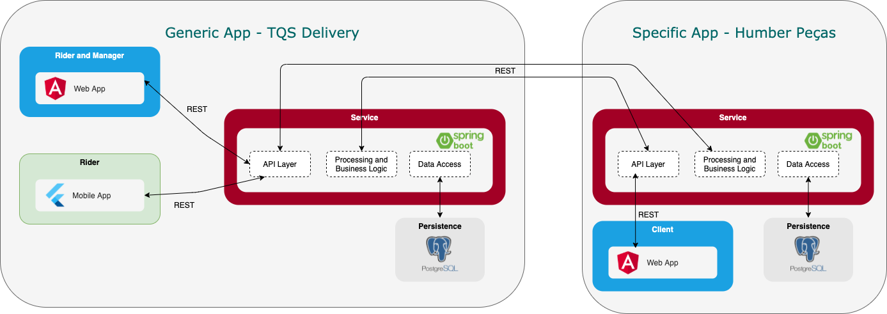

<h1 align="center">
TQS Delivery
</h1>

<p align="center">

<a href="https://www.youtube.com/watch?v=Z-K_IZGJV-Q">
    
  </a>

> Demo video available by clicking on the image
</p>

There is more and more demand for delivery services. The idea of TQS Delivery is to promote a platform aggregating several delivery services into one. Each store will be able to join the platform, having its individual product system and interface, leaving the entire management of drivers to TQS Delivery

As a way to demonstrate the service, an independent system of a tool store was created, Humber Peças, which through TQS Delivery, promotes tool delivery services (Because it is something we need daily and urgently 🤪)

This project aims to create a viable software product (functional specification, system architecture and implementation) and a Software Quality Environment (SQE)

**Built with:**

<table>
  <tr>
    <td valign="top" style="width:100px">
      <div align="center">
       
      <p>Angular</p>
      </div>
    </td>
    <td valign="top" style="width:100px">
      <div align="center">
       
      <p>Flutter</p>
      </div>
    </td>
    <td valign="top" style="width:100px">
      <div align="center">
       
      <p>Spring Boot</p>
      </div>
    </td>
  </tr>
</table> 

## Team Members
* [Mariana Santos](https://github.com/marianasps) - Product Owner
* [Hugo Almeida](https://github.com/hugofpaiva) - DevOps Master
* [Miguel Almeida](https://github.com/Miguel17297) - Team Leader
* [Carolina Araújo](https://github.com/carolinaaraujo00) - QA Engineer

## Architecture

<p align="center">
  
</p>

## How to Run

To run the system, _Docker Compose_ must be installed and updated.

That said, the steps are as follows:

1. Compile services for the execution of _containers Docker_, running at the root of the repository:
   
    ```
    $ docker-compose build
    ```
    
2. Start the _containers_:
    
    ```
    $ docker-compose up -d
    ```
    
The **Client Web application** will be available at: [localhost:80](http://localhost:80)

The **Rider and Manager Web application** will be available at: [localhost:81](http://localhost:81)

## Project Bookmarks

The following links to the system were made available through the _Google Cloud Platform_.

### [**Code Quality Dashboard (SonarQube)**](http://34.89.70.141:9000/) 

Login | admin |
--- | --- |
Password | delivery |

### [**TQS Delivery Web App (Manager and Rider)**](http://35.246.29.122:81) 

**Rider Credentials**
Login | joao@email.com | antonio@email.com |
--- | --- | --- |
Password | difficult-pass | difficult-pass |

**Manager Credentials**
Login | joao1@email.com |
--- | --- |
Password | difficult-pass |

### [**TQS Delivery REST API Docs**](http://35.246.29.122:8081/swagger-ui/index.html) 

### [**Humber Peças Web App (Client)**](http://35.246.29.122:80) 

**Client Credentials**
Login | joao@email.com |
--- | --- |
Password | difficult-pass1 |

### [**Humber Peças REST API Docs**](http://35.246.29.122:8080/swagger-ui/index.html) 

### [**Backlog management with ZenHub**](https://app.zenhub.com/workspaces/tqs-delivery-60ba8a5d5a66c400143cb9dd/board)

### [**Final Presentation Slides**](./presenting/presentation.pdf)

### [**Product Specification Report**](./reporting/product_specification_report.pdf)

### [**QA Manual**](./reporting/qa_manual.pdf)
